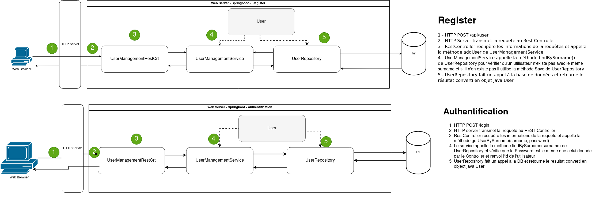
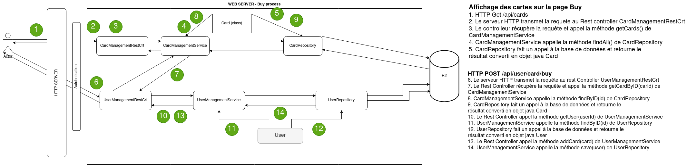
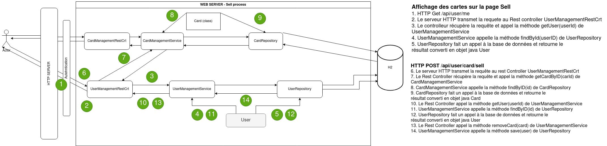
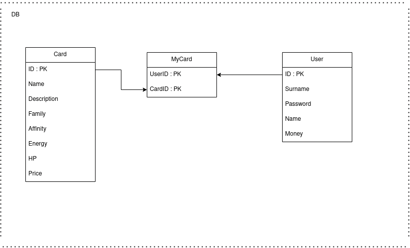

# Atelier 2 - GRP 7

### L'équipe :

* Emile METRAL
* Nicole PIEMONTESE
* Kubilay KAPLAN
* Valentin TOURNIER

### **Les fonctionnalités du Cahier des charges :**

**Création utilisateurs et connexion :**

- Création des utilisateurs depuis /register.html
- Connexion utilisateur depuis /login (+ inscription d'un cookie pour l'authentification)
- Fonctionnalité de déconnexion sur l'interface utilisateur (index.html)

**Interface utilisateur - Menu**

- Vérification de l'authentifcation utilisateur (sinon redirection vers login.html)
- Affichage des informations utilisateurs connecté (balance + nom Prenom) via API /api/user/me
- Bouton SELL et BUY (redirigeant respectivement vers les pages SELL et BUY

**Interface utilisateur - Buy**

- Affichage des informations de l'utilisateur connecté (Balance + Nom)
- Affichage des cartes en vente sur le Market Place (avec détails)
- Possibilité d'achat d'une carte ( Verification argent disponible, MAJ balance et ajout carte à l'utilisateur)

**Interface Utilisateur - Sell**

- Affichage des informations de l'utilisateur connecté (Balance + Nom)
- Affiches de toutes les cartes de l'utilisateur
- Possibilité de ventre la carte (Suppresion carte pour l'utilisateur, MAJ balance et ajout carte au Market place)

### L'architecture :

**Authentification:**

**Achat :**

**Vente :**

**Schéma Base de donnée :**

### Les API :

**CardManagement et UserManagement:**

| Method | URL                 | Description                                                                         |
| -------- | --------------------- | :------------------------------------------------------------------------------------ |
| POST   | /api/cards          |                                                                                     |
| GET    | /api/cards{id}      | Récupère la carte avec l'ID correspondant                                         |
| GET    | /api/cards          | Affiche toutes les cartes                                                           |
|        |                     |                                                                                     |
| POST   | /api/user           | Inscription utilisateur                                                             |
| POST   | /login              | Connexion utilisateur                                                               |
| POST   | /api/user/cards/buy | Achat carte par un utilisateur                                                      |
| POST   | /api/user/card/sell | Vente carte par un utilisateur                                                      |
| GET    | /api/user/{id}      | Affichage utilisateur ID correspondant                                              |
| GET    | /api/user/me        | Affichage toutes les informations de l'utilisateur (Carte + nom, prenom, argent...) |
| POST   | /logout             | Deconnexion de l'utilisateur                                                        |
