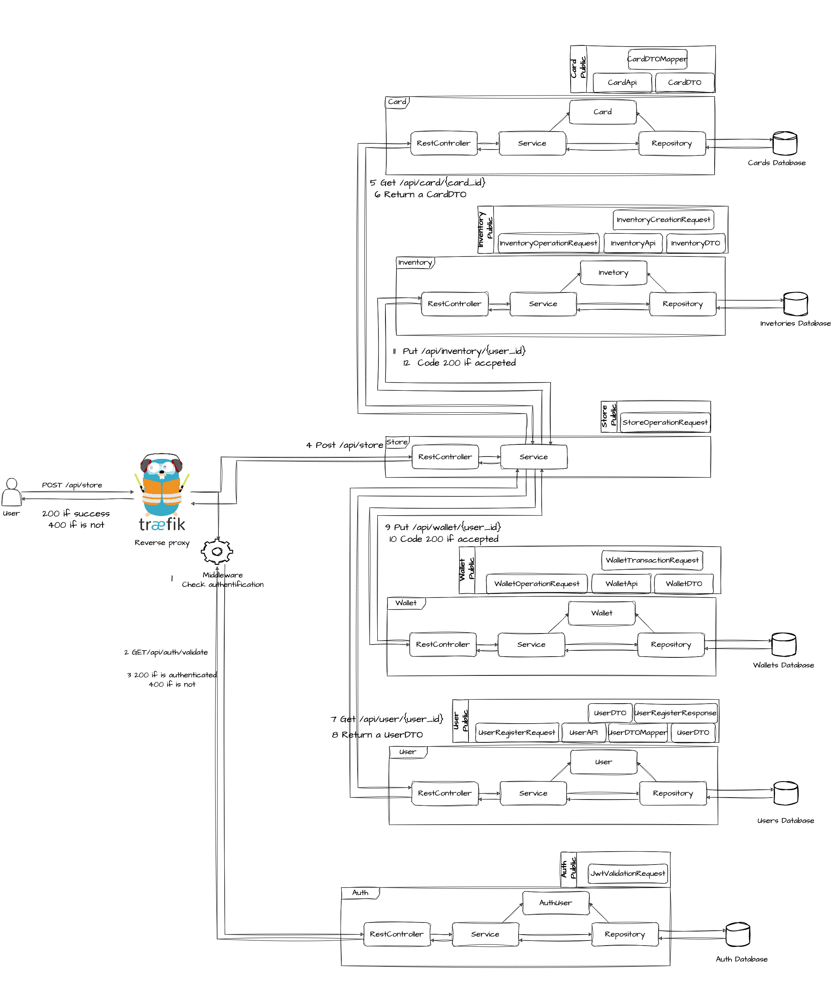

# CardGame

## Description

## **Les fonctionnalités du Cahier des charges :**

### **Sécurisation :**
- Mise en place d'un système d'authentification avec JWT 
- Mise en place du hashage des mots de passe avec BCrypt 
- Endpoint de validation du token 
- Endpoint de récupération de l'id de l'utilisateur correspondant au token 
- Sécurisation des communications avec les microservices à travers un reverse proxy avec Traefik 

### **Microservices :**
- Transformation du projet en microservices
- Création de 7 microservices :
  - Auth : Gestion de l'authentification utilisateur 
  - Card : Gestion des cartes 
  - Game : Gestion des parties 
  - Inventory : Gestion des inventaires 
  - Store : Gestion des transactions 
  - User : Gestion des utilisateurs 
  - Wallet : Gestion des portefeuilles 
  - Common : Package contenant les classes communes à tous les microservices 

### **Tests unitaires :**
- Tests unitaires sur les microservices
  - Auth : Non réalisé
  - Card : Tests sur le Repository, Model, Service et Controler 
  - Game : Tests sur le Repository, Model, Service et Controler 
  - Inventory : Tests sur le Repository, Model, Service et Controler 
  - Store : Tests sur le Service et Controler 
  - User : Tests sur le Repository, Model, Service et Controler 
  - Wallet : Tests sur le Repository, Model, Service et Controler 

### **Nouvelles fonctionnalités : Combat de cartes**
- Création d'une room de jeu avec un nom et une mise 
- Possibilité de rejoindre une room de jeu et de sélectionner une carte 
- Lancement du combat de carte :
  - Chaque carte possède une quantité d'energie qui diminue lors d'une attaque et augmente après chaque tour
  - La puissance de l'attaque dépend de la valeur d'attaque de la carte, de la valeur de défense de la carte adverse, des affinités des cartes et d'une valeur aléatoire
  - Le combat se termine lorsqu'une des deux cartes n'a plus d'énergie
- Le gagnant remporte la mise de la room

Non réalisé :
  
- L'énergie d'une carte n'est pas persistante entre les combats. En effet, l'architecture du projet ne permet pas de stocker en l'état les données d'une carte d'un joueur. Nous stockons uniquement les informations de toutes les cartes dans la base de données. 
Il faudrait donc faire évoluer l'architecture du projet pour pouvoir stocker les informations de chaque carte de chaque joueurs.

### **Containerisation :**
- Création d'un docker-compose pour lancer l'application 
- Création de Dockerfile pour chaque microservice 
- Mise en place d'un reverse proxy avec Traefik 
- Mise en place d'un serveur web avec Nginx 

### **CI/CD :**
- Mise en place d'un pipeline CI avec Gitlab CI pour chaque microservice 

### **Elements supplémentaires :**
- Déployement sur un cluster Kubernetes 
- Architecture AWS 

## L'architecture :

**Inscription:**

**Achat et Vente:**

**Combat de cartes:**

## API :

| Method | URL | Description |
| --- | --- | --- |
| POST | /api/auth/register | Crée un nouvel utilisateur dans l’application. |
| POST | /api/auth/login | Permet à un utilisateur de s'authentifier et d'obtenir un token. |
| GET | /api/auth/validate | Vérifie si le token fourni est valide. |
| POST | /api/auth/validate | Vérifie si le token fourni est valide. |
| POST | /api/auth/user | Récupère l’id de l’utilisateur correspondant au token |

**User:**
| Method | URL | Description |
| --- | --- | --- |
| POST | /api/user | Crée un nouvel utilisateur dans l’application. |
| GET | /api/users/{id} | Récupère les informations d'un utilisateur spécifié par son id. |
| GET | /api/users | Récupère la liste de tous les utilisateurs de l’application . |
| DELETE | /api/users/{id} | Supprime un utilisateur spécifié par son id. |
| PUT | /api/users/{id} | Met à jour les informations d'un utilisateur spécifié par son id. |

**Card:**
| Method | URL | Description |
| --- | --- | --- |
| POST | /api/cards | Crée une nouvelle carte dans l’application. |
| PUT | /api/cards/{id} | Met à jour les informations d'une carte spécifiée par son id. |
| GET | /api/cards/{id} | Récupère les informations d'une carte spécifiée par son id. |
| DELETE | /api/cards/{id} | Supprime une carte spécifiée par son id. |
| GET | /api/cards | Récupère la liste de toutes les cartes de l’application. |
| GET | /api/cards/random | Récupère une carte aléatoire parmi celles disponibles. |

**Store:**
| Method | URL | Description |
| --- | --- | --- |
| POST | /api/store | Effectue une transaction. |

**Inventory:**
| Method | URL | Description |
| --- | --- | --- |
| POST | /api/inventories | Crée un nouvel inventaire pour un utilisateur. |
| GET | /api/inventories/{user_id} | Récupère l'inventaire d'un utilisateur spécifié par son id. |
| PUT | /api/inventories/{user_id} | Met à jour l'inventaire d'un utilisateur spécifié par son id. |
| DELETE | /api/inventories/{user_id} | Supprime l'inventaire d'un utilisateur spécifié par son id. |

**Wallet:**
| Method | URL | Description |
| --- | --- | --- |
| POST | /api/wallets | Crée un nouveau portefeuille pour un utilisateur. |
| GET | /api/wallets/{user_id} | Récupère le portefeuille d'un utilisateur spécifié par son id. |
| PUT | /api/wallets/{user_id} | Met à jour le portefeuille d'un utilisateur spécifié par son id. |
| DELETE | /api/wallets/{user_id} | Supprime le portefeuille d'un utilisateur spécifié par son id. |

**Game:**
| Method | URL | Description |
| --- | --- | --- |
| POST | /api/game/room | Crée une nouvelle partie. |
| GET | /api/game/join/{room_name} | Ajoute un utilisateur à une salle de jeu spécifiée par son nom. |
| PUT | /api/game/room/{room_name} | Sélectionne une carte à jouer dans une partie. |
| GET | /api/game/rooms | Récupère les informations de toutes les parties. |
| GET | /api/game/room/{room_name} | Récupère les informations d'une partie. |